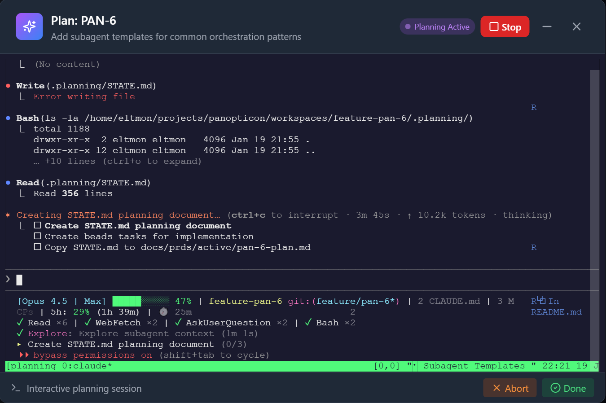

# Panopticon CLI

Multi-agent orchestration for AI coding assistants.

> *"The Panopticon had six sides, one for each of the Founders of Gallifrey..."*

## Overview

Panopticon is a unified orchestration layer for AI coding assistants. It works with:

| Tool | Support |
|------|---------|
| **Claude Code** | Full support |
| **Codex** | Skills sync |
| **Cursor** | Skills sync |
| **Gemini CLI** | Skills sync |
| **Google Antigravity** | Skills sync |

### Features

- **Multi-agent orchestration** - Spawn and manage multiple AI agents in tmux sessions
- **Cloister AI Lifecycle Manager** - Automatic model routing, stuck detection, and specialist handoffs
- **Universal skills** - One SKILL.md format works across all supported tools
- **Heartbeat Hooks** - Real-time agent activity monitoring via Claude Code hooks
- **Multi-project support** - YAML-based project registry with label-based issue routing
- **Health Monitoring** - Deacon-style stuck detection with auto-recovery
- **Context Engineering** - Structured state management (STATE.md, WORKSPACE.md)
- **Agent CVs** - Work history tracking for capability-based routing

---

## Legacy Codebase Support

> **"AI works great on greenfield projects, but it's hopeless on our legacy code."**
>
> Sound familiar? Your developers aren't wrong. But they're not stuck, either.

### The Problem Every Enterprise Faces

AI coding assistants are trained on modern, well-documented open-source code. When they encounter your 15-year-old monolith with:

- Mixed naming conventions (some `snake_case`, some `camelCase`, some `SCREAMING_CASE`)
- Undocumented tribal knowledge ("we never touch the `processUser()` function directly")
- Schemas that don't match the ORM ("the `accounts` table is actually users")
- Three different async patterns in the same codebase
- Build systems that require arcane incantations

...they stumble. Repeatedly. Every session starts from zero.

### Panopticon's Unique Solution: Adaptive Learning

Panopticon includes two AI self-monitoring skills that **no other orchestration framework provides**:

| Skill | What It Does | Business Impact |
|-------|--------------|-----------------|
| **Knowledge Capture** | Detects when AI makes mistakes or gets corrected, prompts to document the learning | AI gets smarter about YOUR codebase over time |
| **Refactor Radar** | Identifies systemic code issues causing repeated AI confusion, creates actionable proposals | Surfaces technical debt that's costing you AI productivity |

#### How It Works

```
Session 1: AI queries users.created_at → Error (column is "createdAt")
           → Knowledge Capture prompts: "Document this convention?"
           → User: "Yes, create skill"
           → Creates project-specific skill documenting naming conventions

Session 2: AI knows to use camelCase for this project
           No more mistakes on column names

Session 5: Refactor Radar detects: "Same entity called 'user', 'account', 'member'
           across layers - this is causing repeated confusion"
           → Offers to create issue with refactoring proposal
           → Tech lead reviews and schedules cleanup sprint
```

#### The Compound Effect

| Week | Without Panopticon | With Panopticon |
|------|-------------------|-----------------|
| 1 | AI makes 20 mistakes/day on conventions | AI makes 20 mistakes, captures 8 learnings |
| 2 | AI makes 20 mistakes/day (no memory) | AI makes 12 mistakes, captures 5 more |
| 4 | AI makes 20 mistakes/day (still no memory) | AI makes 3 mistakes, codebase improving |
| 8 | Developers give up on AI for legacy code | AI is productive, tech debt proposals in backlog |

#### Shared Team Knowledge

**When one developer learns, everyone benefits.**

Captured skills live in your project's `.claude/skills/` directory - they're version-controlled alongside your code. When Sarah documents that "we use camelCase columns" after hitting that error, every developer on the team - and every AI session from that point forward - inherits that knowledge automatically.

```
myproject/
├── .claude/skills/
│   └── project-knowledge/     # ← Git-tracked, shared by entire team
│       └── SKILL.md           # "Database uses camelCase, not snake_case"
├── src/
└── ...
```

No more repeating the same corrections to AI across 10 different developers. No more tribal knowledge locked in one person's head. The team's collective understanding of your codebase becomes permanent, searchable, and automatically applied.

**New hire onboarding?** The AI already knows your conventions from day one.

#### For Technical Leaders

**What gets measured gets managed.** Panopticon's Refactor Radar surfaces the specific patterns that are costing you AI productivity:

- "Here are the 5 naming inconsistencies causing 40% of AI errors"
- "These 3 missing FK constraints led to 12 incorrect deletions last month"
- "Mixed async patterns in payments module caused 8 rollbacks"

Each proposal includes:
- **Evidence**: Specific file paths and examples
- **Impact**: How this affects AI (and new developers)
- **Migration path**: Incremental fix that won't break production

#### For Executives

**ROI is simple:**

- $200K/year senior developer spends 2 hours/day correcting AI on legacy code
- That's $50K/year in wasted productivity per developer
- Team of 10 = **$500K/year** in AI friction

Panopticon's learning system:
- Captures corrections once, applies them forever
- Identifies root causes (not just symptoms)
- Creates actionable improvement proposals
- Works across your entire AI toolchain (Claude, Codex, Cursor, Gemini)

**This isn't "AI for greenfield only." This is AI that learns your business.**

#### Configurable Per Team and Per Developer

Different teams have different ownership boundaries. Individual developers have different preferences. Panopticon respects both:

```markdown
# In ~/.claude/CLAUDE.md (developer's personal config)

## AI Suggestion Preferences

### refactor-radar
skip: database-migrations, infrastructure  # DBA/Platform team handles these
welcome: naming, code-organization         # Always happy for these

### knowledge-capture
skip: authentication                       # Security team owns this
```

- **"Skip database migrations"** - Your DBA has a change management process
- **"Skip infrastructure"** - Platform team owns that
- **"Welcome naming fixes"** - Low risk, high value, always appreciated

The AI adapts to your org structure, not the other way around.

---

## Quick Start

```bash
# Install Panopticon
npm install -g panopticon-cli

# Install prerequisites and setup (includes optional HTTPS/Traefik)
pan install

# Sync skills to all AI tools
pan sync

# Check system health
pan doctor
```

### HTTPS Setup (Optional)

Panopticon supports local HTTPS via Traefik reverse proxy:

```bash
# Full install (includes Traefik + mkcert for HTTPS)
pan install

# Add to /etc/hosts (macOS/Linux)
echo "127.0.0.1 pan.localhost" | sudo tee -a /etc/hosts

# Start with HTTPS
pan up
# → Dashboard: https://pan.localhost
# → Traefik UI: https://traefik.pan.localhost:8080
```

**Minimal install** (skip Traefik, use ports):
```bash
pan install --minimal
pan up
# → Dashboard: http://localhost:3010
```

See [docs/DNS_SETUP.md](docs/DNS_SETUP.md) for detailed DNS configuration (especially for WSL2).

## Supported Platforms

| Platform | Support |
|----------|---------|
| **Linux** | Full support |
| **macOS** | Full support |
| **Windows** | WSL2 required |

> **Windows users:** Panopticon requires WSL2 (Windows Subsystem for Linux 2). Native Windows is not supported. [Install WSL2](https://docs.microsoft.com/en-us/windows/wsl/install)

## Requirements

### Required
- Node.js 18+
- Git (for worktree-based workspaces)
- Docker (for Traefik and workspace containers)
- tmux (for agent sessions)
- **ttyd** - Web terminal for interactive planning sessions. Auto-installed by `pan install`.
- **GitHub CLI (`gh`)** - For GitHub integration (issues, PRs, merges). [Install](https://cli.github.com/)
- **GitLab CLI (`glab`)** - For GitLab integration (if using GitLab). [Install](https://gitlab.com/gitlab-org/cli)

### Optional
- **mkcert** - For HTTPS certificates (recommended)
- **Linear API key** - For issue tracking integration
- **Beads CLI (bd)** - For persistent task tracking across sessions

### Platform Support

The Panopticon dashboard includes terminal streaming, which requires a native binary (`node-pty`). Prebuilt binaries are available for:

| Platform | Architecture | Support |
|----------|-------------|---------|
| macOS | Intel (x64) | ✅ Prebuilt |
| macOS | Apple Silicon (arm64) | ✅ Prebuilt |
| Linux | x64 (glibc) | ✅ Prebuilt |
| Linux | arm64 (glibc) | ✅ Prebuilt |
| Linux | musl (Alpine) | ✅ Prebuilt |
| Windows | x64 | ✅ Prebuilt |

If a prebuilt binary is not available for your platform, node-gyp will automatically compile from source during installation (requires Python and build tools).

### Why CLI tools instead of API tokens?

Panopticon uses `gh` and `glab` CLIs instead of raw API tokens because:
- **Better auth**: OAuth tokens that auto-refresh (no expiring PATs)
- **Simpler setup**: `gh auth login` handles everything
- **Agent-friendly**: Agents can use them for PRs, merges, reviews

## Configuration

Create `~/.panopticon.env`:

```bash
LINEAR_API_KEY=lin_api_xxxxx
GITHUB_TOKEN=ghp_xxxxx  # Optional: for GitHub-tracked projects
RALLY_API_KEY=_xxxxx    # Optional: for Rally as secondary tracker
```

### Issue Trackers

Panopticon supports multiple issue trackers:

| Tracker | Role | Configuration |
|---------|------|---------------|
| **Linear** | Primary tracker | `LINEAR_API_KEY` in `.panopticon.env` |
| **GitHub Issues** | Secondary tracker | `GITHUB_TOKEN` or `gh auth login` |
| **GitLab Issues** | Secondary tracker | `glab auth login` |
| **Rally** | Secondary tracker | `RALLY_API_KEY` in `.panopticon.env` |

Secondary trackers sync issues to the dashboard alongside Linear issues, allowing unified project management.

### Register Projects

Register your local project directories so Panopticon knows where to create workspaces:

```bash
# Register a project
pan project add /path/to/your/project --name myproject

# List registered projects
pan project list
```

### Map Linear Projects to Local Directories

If you have multiple Linear projects, configure which local directory each maps to. Create/edit `~/.panopticon/project-mappings.json`:

```json
[
  {
    "linearProjectId": "abc123",
    "linearProjectName": "Mind Your Now",
    "linearPrefix": "MIN",
    "localPath": "/home/user/projects/myn"
  },
  {
    "linearProjectId": "def456",
    "linearProjectName": "Househunt",
    "linearPrefix": "HH",
    "localPath": "/home/user/projects/househunt"
  }
]
```

The dashboard uses this mapping to determine where to create workspaces when you click "Create Workspace" or "Start Agent" for an issue.

## Cloister: AI Lifecycle Manager

Cloister is Panopticon's intelligent agent lifecycle manager. It monitors all running agents and automatically handles:

- **Model Routing** - Routes tasks to appropriate models based on complexity
- **Stuck Detection** - Identifies agents that have stopped making progress
- **Automatic Handoffs** - Escalates to specialists when needed
- **Specialist Coordination** - Manages test-agent, review-agent, and merge-agent

### How Cloister Works

```
┌─────────────────────────────────────────────────────────────┐
│                     CLOISTER SERVICE                         │
│                                                              │
│  ┌─────────────┐    ┌─────────────┐    ┌─────────────┐     │
│  │  Heartbeat  │───▶│   Trigger   │───▶│   Handoff   │     │
│  │   Monitor   │    │   Detector  │    │   Manager   │     │
│  └─────────────┘    └─────────────┘    └─────────────┘     │
│         │                  │                  │             │
│         ▼                  ▼                  ▼             │
│  ┌─────────────┐    ┌─────────────┐    ┌─────────────┐     │
│  │   Agent     │    │  Complexity │    │ Specialists │     │
│  │   Health    │    │   Analysis  │    │             │     │
│  └─────────────┘    └─────────────┘    └─────────────┘     │
└─────────────────────────────────────────────────────────────┘
```

### Starting Cloister

```bash
# Via dashboard - click "Start" in the Cloister status bar
# Or via CLI:
pan cloister start

# Check status
pan cloister status

# Stop monitoring
pan cloister stop
```

### Specialists

Cloister manages specialized agents that handle specific phases of the development lifecycle:

| Specialist | Purpose | Trigger |
|------------|---------|---------|
| **test-agent** | Runs test suite after implementation | `implementation_complete` signal |
| **review-agent** | Code review before merge | After tests pass (manual trigger) |
| **merge-agent** | Handles git merge and conflict resolution | "Approve & Merge" button |

#### Merge Agent Workflow

The merge-agent is a specialist that handles **ALL** merges, not just conflicts. This ensures:
- It sees all code changes coming through the pipeline
- It builds context about the codebase over time
- When conflicts DO occur, it has better understanding for intelligent resolution
- Tests are always run before completing the merge

**Workflow:**

1. **Pull latest main** - Ensures local main is up-to-date
2. **Analyze incoming changes** - Reviews what the feature branch contains
3. **Perform merge** - Merges feature branch into main
4. **Resolve conflicts** - If conflicts exist, uses AI to resolve them intelligently
5. **Run tests** - Verifies the merge didn't break anything
6. **Commit merge** - Commits the merge with descriptive message
7. **Report results** - Returns success/failure with details

**Triggering merge-agent:**

```bash
# Via dashboard - click "Approve & Merge" on an issue card
# merge-agent is ALWAYS invoked, regardless of whether conflicts exist

# Via CLI
pan specialists wake merge-agent --issue MIN-123
```

The merge-agent uses a specialized prompt template that instructs it to:
- Never force-push
- Always run tests before completing
- Document conflict resolution decisions
- Provide detailed feedback on what was merged

#### Specialist Auto-Initialization

When Cloister starts, it automatically initializes specialists that don't exist yet. This ensures the test-agent, review-agent, and merge-agent are ready to receive wake signals without manual setup.

### Automatic Handoffs

Cloister detects situations that require intervention:

| Trigger | Condition | Action |
|---------|-----------|--------|
| **stuck_escalation** | No activity for 30+ minutes | Escalate to more capable model |
| **complexity_upgrade** | Task complexity exceeds model capability | Route to Opus |
| **implementation_complete** | Agent signals work is done | Wake test-agent |
| **test_failure** | Tests fail repeatedly | Escalate model or request help |
| **planning_complete** | Planning session finishes | Transition to implementation |
| **merge_requested** | User clicks "Approve & Merge" | Wake merge-agent |

### Handoff Methods

Cloister supports two handoff methods, automatically selected based on agent type:

| Method | When Used | How It Works |
|--------|-----------|--------------|
| **Kill & Spawn** | General agents (agent-min-123, etc.) | 1. Captures full context (STATE.md, beads, git state)<br>2. Kills tmux session<br>3. Spawns new agent with handoff prompt<br>4. New agent continues work with preserved context |
| **Specialist Wake** | Permanent specialists (merge-agent, test-agent) | 1. Captures handoff context<br>2. Sends wake message to existing session<br>3. Specialist resumes with context injection |

**Kill & Spawn** is used for temporary agents that work on specific issues. It creates a clean handoff by:
- Capturing the agent's current understanding (from STATE.md)
- Preserving beads task progress and open items
- Including relevant git diff and file context
- Building a comprehensive handoff prompt for the new model

**Specialist Wake** is used for permanent specialists that persist across multiple issues. It avoids the overhead of killing/respawning by injecting context into the existing session.

### Handoff Context Capture

When a handoff occurs, Cloister captures:

```json
{
  "agentId": "agent-min-123",
  "issueId": "MIN-123",
  "currentModel": "sonnet",
  "targetModel": "opus",
  "reason": "stuck_escalation",
  "handoffCount": 1,
  "state": {
    "phase": "implementation",
    "complexity": "complex",
    "lastActivity": "2024-01-22T10:30:00-08:00"
  },
  "beadsTasks": [...],
  "gitContext": {
    "branch": "feature/min-123",
    "uncommittedChanges": ["src/auth.ts", "src/tests/auth.test.ts"],
    "recentCommits": [...]
  }
}
```

Handoff prompts are saved to `~/.panopticon/agents/{agent-id}/handoffs/` for debugging.

### Heartbeat Monitoring

Agents send heartbeats via Claude Code hooks. Cloister tracks:

- Last tool use and timestamp
- Current task being worked on
- Git branch and workspace
- Process health

Heartbeat files are stored in `~/.panopticon/heartbeats/`:

```json
{
  "timestamp": "2024-01-22T10:30:00-08:00",
  "agent_id": "agent-min-123",
  "tool_name": "Edit",
  "last_action": "{\"file_path\":\"/path/to/file.ts\"...}",
  "git_branch": "feature/min-123",
  "workspace": "/home/user/projects/myapp/workspaces/feature-min-123"
}
```

### Heartbeat Hook Installation

The heartbeat hook is automatically synced to `~/.panopticon/bin/heartbeat-hook` via `pan sync`. It's also installed automatically when you install or upgrade Panopticon via npm.

**Manual installation:**
```bash
pan sync  # Syncs all skills, agents, AND hooks
```

**Hook configuration in `~/.claude/settings.json`:**
```json
{
  "hooks": {
    "PostToolUse": [
      {
        "matcher": "*",
        "hooks": [
          {
            "type": "command",
            "command": "~/.panopticon/bin/heartbeat-hook"
          }
        ]
      }
    ]
  }
}
```

**Hook resilience:** The heartbeat hook is designed to fail silently if:
- The heartbeats directory doesn't exist
- Write permissions are missing
- The hook script has errors

This prevents hook failures from interrupting agent work.

### Configuration

Cloister configuration lives in `~/.panopticon/cloister/config.json`:

```json
{
  "monitoring": {
    "heartbeat_interval_ms": 5000,
    "stuck_threshold_minutes": 30,
    "health_check_interval_ms": 30000
  },
  "specialists": {
    "test_agent": { "enabled": true, "auto_wake": true },
    "review_agent": { "enabled": true, "auto_wake": false },
    "merge_agent": { "enabled": true, "auto_wake": false }
  },
  "triggers": {
    "stuck_escalation": { "enabled": true },
    "complexity_upgrade": { "enabled": true }
  }
}
```

---

## Model Routing & Complexity Detection

Cloister automatically routes tasks to the appropriate model based on detected complexity, optimizing for cost while ensuring quality.

### Complexity Levels

| Level | Model | Use Case |
|-------|-------|----------|
| **trivial** | Haiku | Typos, comments, documentation updates |
| **simple** | Haiku | Small fixes, test additions, minor changes |
| **medium** | Sonnet | Features, components, integrations |
| **complex** | Sonnet/Opus | Refactors, migrations, redesigns |
| **expert** | Opus | Architecture, security, performance optimization |

### Complexity Detection Signals

Complexity is detected from multiple signals (in priority order):

1. **Explicit field** - Task has a `complexity` field set (e.g., in beads)
2. **Labels/tags** - Issue labels like `architecture`, `security`, `refactor`
3. **Keywords** - Title/description contains keywords like "migration", "overhaul"
4. **File count** - Number of files changed (>20 files = complex)
5. **Time estimate** - If estimate exceeds thresholds

**Keyword patterns:**
```javascript
{
  trivial: ['typo', 'rename', 'comment', 'documentation', 'readme'],
  simple: ['add comment', 'update docs', 'fix typo', 'small fix'],
  medium: ['feature', 'endpoint', 'component', 'service'],
  complex: ['refactor', 'migration', 'redesign', 'overhaul'],
  expert: ['architecture', 'security', 'performance optimization']
}
```

### Configuring Model Routing

Edit `~/.panopticon/cloister/config.json`:

```json
{
  "model_selection": {
    "default_model": "sonnet",
    "complexity_routing": {
      "trivial": "haiku",
      "simple": "haiku",
      "medium": "sonnet",
      "complex": "sonnet",
      "expert": "opus"
    }
  }
}
```

### Cost Optimization

Model routing helps optimize costs:

| Model | Relative Cost | Best For |
|-------|---------------|----------|
| Haiku | 1x (cheapest) | Simple tasks, bulk operations |
| Sonnet | 3x | Most development work |
| Opus | 15x | Complex architecture, critical fixes |

A typical agent run might:
1. Start on Haiku for initial exploration
2. Escalate to Sonnet for implementation
3. Escalate to Opus only if stuck or complexity detected

---

## Multi-Project Support

Panopticon supports managing multiple projects with intelligent issue routing.

### Project Registry

Projects are registered in `~/.panopticon/projects.yaml`:

```yaml
projects:
  myn:
    name: "Mind Your Now"
    path: /home/user/projects/myn
    linear_team: MIN
    issue_routing:
      - labels: [splash, landing-pages, seo]
        path: /home/user/projects/myn/splash
      - labels: [docs, marketing]
        path: /home/user/projects/myn/docs
      - default: true
        path: /home/user/projects/myn

  panopticon:
    name: "Panopticon"
    path: /home/user/projects/panopticon
    linear_team: PAN
```

### Label-Based Routing

Issues are routed to different subdirectories based on their labels:

1. **Labeled issues** - Matched against `issue_routing` rules in order
2. **Default route** - Issues without matching labels use the `default: true` path
3. **Fallback** - If no default, uses the project root path

Example: An issue with label "splash" in the MIN team would create its workspace at `/home/user/projects/myn/splash/workspaces/feature-min-xxx/`.

### Managing Projects

```bash
# List registered projects
pan project list

# Add a project
pan project add /path/to/project --name myproject --linear-team PRJ

# Remove a project
pan project remove myproject
```

---

## Commands

### Core Commands

```bash
pan init              # Initialize ~/.panopticon/
pan sync              # Sync skills, commands, agents, AND hooks to all AI tools
pan sync --dry-run    # Preview what will be synced
pan doctor            # Check system health
pan skills            # List available skills
pan status            # Show running agents
pan up                # Start dashboard (Docker or minimal)
pan down              # Stop dashboard and services
pan update            # Update Panopticon to latest version
pan backup            # Create backup of ~/.panopticon/
pan restore           # Restore from backup
pan setup hooks       # Install Claude Code hooks (heartbeat, etc.)
```

#### What `pan sync` Does

`pan sync` synchronizes Panopticon assets to all supported AI tools:

| Asset Type | Source | Destinations |
|------------|--------|--------------|
| **Skills** | `~/.panopticon/skills/` | `~/.claude/skills/`, `~/.codex/skills/`, `~/.gemini/skills/` |
| **Agents** | `~/.panopticon/agents/*.md` | `~/.claude/agents/` |
| **Commands** | `~/.panopticon/commands/` | `~/.claude/commands/` |
| **Hooks** | `src/hooks/` (in package) | `~/.panopticon/bin/` |

**Automatic sync:** Hooks are also synced automatically when you install or upgrade Panopticon via npm (`postinstall` hook).

### Agent Management

```bash
# Spawn an agent for a Linear issue
pan work issue MIN-123

# List all running agents
pan work status

# Send a message to an agent (handles Enter key automatically)
pan work tell min-123 "Please also add tests"

# Kill an agent
pan work kill min-123

# Show work completed and awaiting review
pan work pending

# Approve agent work, merge MR, update Linear
pan work approve min-123

# List issues from configured trackers
pan work list

# Triage issues from secondary tracker
pan work triage

# Reopen a closed issue and re-run planning
pan work reopen min-123

# Recover crashed agents
pan work recover min-123
pan work recover --all
```

### Health Monitoring

```bash
# Run a health check
pan work health check

# Show health status of all agents
pan work health status

# Start the health daemon (background monitoring)
pan work health daemon --interval 30
```

### FPP Hooks (Fixed Point Principle)

```bash
# Check for pending work on hook
pan work hook check

# Push work to an agent's hook
pan work hook push agent-min-123 "Continue with tests"

# Send mail to an agent
pan work hook mail agent-min-123 "Review feedback received"
```

### Workspace Management

**Workspaces are git worktrees** - isolated working directories for each issue/feature. Each workspace:
- Has its own feature branch (e.g., `feature/min-123-add-login`)
- Shares git history with the main repo (no separate clone)
- Can run independently (separate node_modules, builds, etc.)
- Is located at `{project}/workspaces/{issue-id}/`

This allows multiple agents to work on different features simultaneously without conflicts.

#### Git-Backed Collaborative Planning

| Start Planning | Codebase Exploration | Discovery Questions |
|----------------|---------------------|---------------------|
|  |  |  |
| Click to create workspace and start AI planning | Claude explores the codebase, reads docs, understands patterns | Interactive questions to clarify requirements and approach |

Planning artifacts are stored **inside the workspace**, making them part of the feature branch:

```
workspaces/feature-min-123/
├── .planning/
│   ├── output.jsonl          # Full conversation history (tool uses + results)
│   ├── PLANNING_PROMPT.md    # Initial planning prompt
│   ├── CONTINUATION_PROMPT.md # Context for continued sessions
│   └── output-*.jsonl        # Backup of previous rounds
└── ... (code)
```



When the planning session completes, the AI generates:
- **STATE.md** - Current understanding, decisions made, and implementation plan
- **Beads tasks** - Trackable sub-tasks with dependencies for the implementation
- **Feature PRD** - Copied to `docs/prds/active/{issue}-plan.md` for documentation

**This enables:**

1. **Collaborative async planning** - Push your branch, someone else pulls and continues the planning session with full context
2. **Context recovery** - If Claude's context compacts, the full conversation is preserved in the branch
3. **Audit trail** - See how planning decisions were made, what files were explored, what questions were asked
4. **Branch portability** - The planning state travels with the feature branch

**Dashboard workflow (recommended):**

The planning dialog has **Pull** and **Push** buttons that handle git operations automatically:

| Button | What it does |
|--------|--------------|
| **Pull** | Fetches from origin, creates workspace from remote branch if needed, pulls latest changes |
| **Push** | Commits `.planning/` artifacts and pushes to origin |

1. Person A starts planning in dashboard, clicks **Push** when interrupted
2. Person B opens same issue in dashboard, clicks **Pull** → gets Person A's full context
3. Person B continues the planning session and clicks **Push** when done

**CLI workflow:**
```bash
# Person A starts planning
pan work plan MIN-123
# ... answers discovery questions, gets interrupted ...

# Push the branch (includes planning context)
cd workspaces/feature-min-123
git add .planning && git commit -m "WIP: planning session"
git push origin feature/min-123

# Person B continues
git pull origin feature/min-123
pan work plan MIN-123 --continue
# Claude has full context from Person A's session
```

```bash
# Create a workspace (git worktree) without starting an agent
pan workspace create MIN-123

# List all workspaces
pan workspace list

# Destroy a workspace
pan workspace destroy MIN-123

# Force destroy (even with uncommitted changes)
pan workspace destroy MIN-123 --force
```

### Project Management

```bash
# Register a project
pan project add /path/to/project --name myproject

# List managed projects
pan project list

# Show project details
pan project show myproject

# Initialize project config (creates .panopticon.json)
pan project init

# Remove a project
pan project remove myproject
```

### Context Management

```bash
# Show agent state
pan work context state agent-min-123

# Set a checkpoint
pan work context checkpoint "Completed auth module"

# Search history
pan work context history "test"
```

### Agent CVs

```bash
# View an agent's CV (work history)
pan work cv agent-min-123

# Show agent rankings by success rate
pan work cv --rankings
```

### Crash Recovery

```bash
# Recover a specific crashed agent
pan work recover min-123

# Auto-recover all crashed agents
pan work recover --all
```

### Cloister Commands

```bash
# Start Cloister monitoring service
pan cloister start

# Stop Cloister
pan cloister stop

# Emergency stop all agents (force kill)
pan cloister emergency-stop

# Check Cloister status
pan cloister status

# List all specialists
pan specialists list

# Wake a specialist (resumes previous session if exists)
pan specialists wake merge-agent

# Wake and send a task
pan specialists wake merge-agent --task "Review PR #123 for security issues"

# View specialist queue
pan specialists queue merge-agent

# Reset a single specialist (wipes context)
pan specialists reset merge-agent

# Reset ALL specialists (fresh start)
pan specialists reset --all
```

## Dashboard


Start the monitoring dashboard:

```bash
pan up
```

**Recommended (containerized with HTTPS):**
- Dashboard: https://pan.localhost
- Traefik UI: https://traefik.pan.localhost:8082

This runs everything in Docker containers, avoiding port conflicts with your other projects.

**Minimal install (no Docker):**
```bash
pan up --minimal
```
- Dashboard: http://localhost:3010

Stop with `pan down`.

### Dashboard Tabs

| Tab | Purpose |
|-----|---------|
| **Board** | Kanban view of Linear issues with drag-and-drop status changes |
| **Agents** | Running agent sessions with terminal output |
| **Activity** | Real-time `pan` command output log |
| **Metrics** | Runtime comparison and cost tracking |
| **Skills** | Available skills and their descriptions |
| **Health** | System health checks and diagnostics |

### Issue Cards

Issue cards on the Kanban board display:

- **Cost badges** - Color-coded by amount ($0-5 green, $5-20 yellow, $20+ red)
- **Container status** - Shows if workspace has Docker containers (running/stopped)
- **Agent status** - Indicates if an agent is currently working on the issue
- **Workspace status** - Shows if workspace exists, is corrupted, or needs creation

### Workspace Actions

Click an issue card to open the workspace detail panel:

| Button | Action |
|--------|--------|
| **Create Workspace** | Creates git worktree for the issue |
| **Containerize** | Adds Docker containers to an existing workspace |
| **Start Containers** | Starts stopped Docker containers |
| **Start Planning** | Opens interactive planning session with AI |
| **Start Agent** | Spawns autonomous agent in tmux |
| **Approve & Merge** | Triggers merge-agent to handle PR merge |

### Interactive Planning

The planning dialog provides a real-time terminal for collaborative planning:

- **Discovery questions** - AI asks clarifying questions before implementation
- **Codebase exploration** - AI reads files and understands patterns
- **Pull/Push buttons** - Git operations to share planning context with teammates
- **AskUserQuestion rendering** - Questions from the AI appear as interactive prompts

### Metrics & Cost Tracking

The **Metrics** tab provides insights into AI agent performance and costs:

- **Per-issue cost badges** - See costs directly on Kanban cards (color-coded by amount)
- **Issue cost breakdown** - Click an issue to see detailed costs by model and session
- **Runtime comparison** - Compare success rates, duration, and costs across runtimes (Claude, Codex, etc.)
- **Capability analysis** - See how different task types (feature, bugfix, refactor) perform

Cost data is stored in `~/.panopticon/`:
- `session-map.json` - Links Claude Code sessions to issues
- `runtime-metrics.json` - Aggregated runtime performance data
- `costs/` - Raw cost logs

**API Endpoints:**

| Endpoint | Description |
|----------|-------------|
| `GET /api/costs/summary` | Overall cost summary (today/week/month) |
| `GET /api/costs/by-issue` | Costs grouped by issue |
| `GET /api/issues/:id/costs` | Cost details for a specific issue |
| `GET /api/metrics/runtimes` | Runtime comparison metrics |
| `GET /api/metrics/tasks` | Recent task history |

## Skills

Panopticon ships with 25+ skills organized into categories:

### Development Workflows

| Skill | Description |
|-------|-------------|
| `feature-work` | Standard feature development workflow |
| `bug-fix` | Systematic bug investigation and fix |
| `refactor` | Safe refactoring with test coverage |
| `code-review` | Comprehensive code review checklist |
| `code-review-security` | OWASP Top 10 security analysis |
| `code-review-performance` | Algorithm and resource optimization |
| `release` | Step-by-step release process |
| `dependency-update` | Safe dependency updates |
| `incident-response` | Production incident handling |
| `onboard-codebase` | Understanding new codebases |
| `work-complete` | Checklist for completing agent work |

### AI Self-Monitoring

| Skill | Description |
|-------|-------------|
| `knowledge-capture` | Captures learnings when AI gets confused or corrected |
| `refactor-radar` | Detects systemic issues causing AI confusion |
| `session-health` | Detect and clean up stuck sessions |

### Panopticon Operations (pan-*)

| Skill | Description |
|-------|-------------|
| `pan-help` | Show all Panopticon commands |
| `pan-up` | Start dashboard and services |
| `pan-down` | Stop dashboard and services |
| `pan-status` | Show running agents |
| `pan-issue` | Spawn agent for an issue |
| `pan-plan` | Create execution plan for issue |
| `pan-tell` | Send message to running agent |
| `pan-kill` | Kill a running agent |
| `pan-approve` | Approve agent work and merge |
| `pan-health` | Check system health |
| `pan-sync` | Sync skills to AI tools |
| `pan-install` | Install prerequisites |
| `pan-setup` | Initial setup wizard |
| `pan-quickstart` | Quick start guide |
| `pan-projects` | Manage registered projects |
| `pan-tracker` | Issue tracker operations |
| `pan-logs` | View agent logs |
| `pan-rescue` | Recover crashed agents |
| `pan-diagnose` | Diagnose agent issues |
| `pan-docker` | Docker operations |
| `pan-network` | Network diagnostics |
| `pan-config` | Configuration management |
| `pan-restart` | Safely restart Panopticon dashboard and services |
| `pan-code-review` | Orchestrate parallel code review (3 reviewers + synthesis) |
| `pan-convoy-synthesis` | Synthesize convoy coordination |
| `pan-subagent-creator` | Create specialized subagents |
| `pan-skill-creator` | Create new skills (guided) |

### Utilities

| Skill | Description |
|-------|-------------|
| `beads` | Git-backed issue tracking with dependencies |
| `skill-creator` | Guide for creating new skills |
| `web-design-guidelines` | UI/UX review checklist |

## Subagents

Panopticon includes specialized subagent templates for common development tasks. Subagents are invoked via the Task tool or convoy orchestration for parallel execution.

### Code Review Subagents

| Subagent | Model | Focus | Output |
|----------|-------|-------|--------|
| `code-review-correctness` | haiku | Logic errors, edge cases, type safety | `.claude/reviews/<timestamp>-correctness.md` |
| `code-review-security` | sonnet | OWASP Top 10, vulnerabilities | `.claude/reviews/<timestamp>-security.md` |
| `code-review-performance` | haiku | Algorithms, N+1 queries, memory | `.claude/reviews/<timestamp>-performance.md` |
| `code-review-synthesis` | sonnet | Combines all findings into unified report | `.claude/reviews/<timestamp>-synthesis.md` |

**Usage Example:**
```bash
/pan-code-review --files "src/auth/*.ts"
```

This spawns all three reviewers in parallel, then synthesizes their findings into a prioritized report.

### Planning & Exploration Subagents

| Subagent | Model | Focus | Permission Mode |
|----------|-------|-------|-----------------|
| `planning-agent` | sonnet | Codebase research, execution planning | `plan` (read-only) |
| `codebase-explorer` | haiku | Fast architecture discovery, pattern finding | `plan` (read-only) |
| `triage-agent` | haiku | Issue categorization, complexity estimation | default |
| `health-monitor` | haiku | Agent stuck detection, log analysis | default |

**Usage Examples:**
```bash
# Explore codebase architecture
Task(subagent_type='codebase-explorer', prompt='Map out the authentication system')

# Triage an issue
Task(subagent_type='triage-agent', prompt='Categorize and estimate ISSUE-123')

# Check agent health
Task(subagent_type='health-monitor', prompt='Check status of all running agents')
```

### Parallel Code Review Workflow

The `/pan-code-review` skill orchestrates a comprehensive parallel review:

```
1. Determine scope (git diff, files, or branch)
2. Spawn 3 parallel reviewers:
   ├─→ correctness (logic, types)
   ├─→ security (vulnerabilities)
   └─→ performance (bottlenecks)
3. Each writes findings to .claude/reviews/
4. Spawn synthesis agent
5. Synthesis combines all findings
6. Present unified, prioritized report
```

**Benefits:**
- **3x faster** than sequential reviews
- **Comprehensive coverage** across all dimensions
- **Prioritized findings** (blocker > critical > high > medium > low)
- **Actionable recommendations** with code examples

**Review Output:**
```markdown
# Code Review - Complete Analysis

## Executive Summary
**Overall Assessment:** Needs Major Revisions
**Key Findings:**
- 1 blocker (SQL injection)
- 4 critical issues
- 6 high-priority items

## Blocker Issues
### 1. [Security] SQL Injection in login endpoint
...

## Critical Issues
...
```

### Creating Custom Subagents

Use the `/pan-subagent-creator` skill to create project-specific subagents:

```bash
/pan-subagent-creator
```

Subagent templates live in `~/.panopticon/agents/` and sync to `~/.claude/agents/`.

### Reserved Skill Names

Panopticon reserves all skill names listed above. **Do not use these names for project-specific skills** to avoid conflicts.

**Recommendation:** Use a project-specific prefix for your skills (e.g., `myn-standards`, `acme-deployment`) to avoid namespace collisions.

### Project-Specific Skills

Projects can have their own skills alongside Panopticon's:

```
~/.claude/skills/
├── pan-help/           # Symlink → ~/.panopticon/skills/pan-help/
├── feature-work/       # Symlink → ~/.panopticon/skills/feature-work/
└── ... (other pan skills)

{project}/.claude/skills/
├── myn-standards/      # Project-specific (git-tracked)
└── myn-api-patterns/   # Project-specific (git-tracked)
```

Project-specific skills in `{project}/.claude/skills/` are **not managed by Panopticon**. They live in your project's git repo and take precedence over global skills with the same name.

### Skill Distribution

Skills are synced to all supported AI tools via symlinks:

```bash
~/.panopticon/skills/    # Canonical source
    ↓ pan sync
~/.claude/skills/        # Claude Code + Cursor
~/.codex/skills/         # Codex
~/.gemini/skills/        # Gemini CLI
```

## PRD Convention

Panopticon enforces a standard approach to Product Requirements Documents (PRDs) across all managed projects.

### PRD Structure

Every project has a **canonical PRD** that defines the core product:

```
{project}/
├── docs/
│   └── PRD.md              # The canonical PRD (core product definition)
├── workspaces/
│   └── feature-{issue}/
│       └── docs/
│           └── {ISSUE}-plan.md   # Feature PRD (lives in feature branch)
```

| PRD Type | Location | Purpose |
|----------|----------|---------|
| **Canonical PRD** | `docs/PRD.md` | Core product definition, always on main |
| **Feature PRD** | `workspaces/feature-{issue}/docs/{ISSUE}-plan.md` | Feature spec, lives in feature branch, merged with PR |

### Feature PRDs Live in Workspaces

When you start planning an issue, Panopticon creates:
1. A git worktree (workspace) for the feature branch
2. A planning session that generates a feature PRD

The feature PRD **lives in the workspace** (feature branch) because:
- It gets merged with the PR (documentation travels with code)
- If you abort planning and delete the workspace, you don't want orphaned PRDs
- Clean separation - each feature is self-contained

### Project Initialization

When registering a new project with Panopticon (`pan project add`), the system will:

1. **Check for existing PRD** - Look for `docs/PRD.md`, `PRD.md`, `README.md`, or similar
2. **If found**: Use it to create/update the canonical PRD format, prompting for any missing crucial information
3. **If not found**: Generate one by:
   - Analyzing the codebase structure
   - Identifying key technologies and patterns
   - Asking discovery questions about the product

This ensures every Panopticon-managed project has a well-defined canonical PRD that agents can reference.

### PRD Naming Convention

| Document | Naming | Example |
|----------|--------|---------|
| Canonical PRD | `PRD.md` | `docs/PRD.md` |
| Feature PRD | `{ISSUE}-plan.md` | `MIN-123-plan.md`, `PAN-4-plan.md` |
| Planning artifacts | In `.planning/{issue}/` | `.planning/min-123/STATE.md` |

## Architecture

```
~/.panopticon/
  config.toml           # Main configuration
  projects.yaml         # Multi-project registry with issue routing
  project-mappings.json # Linear project → local path mappings (legacy)
  session-map.json      # Claude sessions → issue linking
  runtime-metrics.json  # Runtime performance metrics

  skills/               # Shared skills (SKILL.md format)
  commands/             # Slash commands
  agents/               # Subagent templates (.md files)
  bin/                  # Hook scripts (synced via pan sync)
    heartbeat-hook      # Real-time activity monitoring hook

  agents/               # Per-agent runtime state
    agent-min-123/
      state.json        # Agent state (model, phase, complexity)
      health.json       # Health status
      hook.json         # FPP work queue
      cv.json           # Work history
      mail/             # Incoming messages
      handoffs/         # Handoff prompts (for debugging)

  cloister/             # Cloister AI lifecycle manager
    config.json         # Cloister settings
    state.json          # Running state
    events.jsonl        # Handoff event log

  heartbeats/           # Real-time agent activity
    agent-min-123.json  # Last heartbeat from agent

  logs/                 # Log files
    handoffs.jsonl      # All handoff events (for analytics)

  costs/                # Raw cost logs (JSONL)
  backups/              # Sync backups
  traefik/              # Traefik reverse proxy config
    dynamic/            # Dynamic route configs
    certs/              # TLS certificates
```

### Agent State Management

Each agent's state is tracked in `~/.panopticon/agents/{agent-id}/state.json`:

```json
{
  "id": "agent-min-123",
  "issueId": "MIN-123",
  "workspace": "/home/user/projects/myapp/workspaces/feature-min-123",
  "branch": "feature/min-123",
  "phase": "implementation",
  "model": "sonnet",
  "complexity": "medium",
  "handoffCount": 0,
  "sessionId": "abc123",
  "createdAt": "2024-01-22T10:00:00-08:00",
  "updatedAt": "2024-01-22T10:30:00-08:00"
}
```

| Field | Description |
|-------|-------------|
| `phase` | Current work phase: `planning`, `implementation`, `testing`, `review`, `merging` |
| `model` | Current model: `haiku`, `sonnet`, `opus` |
| `complexity` | Detected complexity: `trivial`, `simple`, `medium`, `complex`, `expert` |
| `handoffCount` | Number of times the agent has been handed off to a different model |
| `sessionId` | Claude Code session ID (for resuming after handoff) |

**State Cleanup:** When an agent is killed or aborted (`pan work kill`), Panopticon automatically cleans up its state files to prevent stale data from affecting future runs.

## Health Monitoring (Deacon Pattern)

Panopticon implements the Deacon pattern for stuck agent detection:

- **Ping timeout**: 30 seconds
- **Consecutive failures**: 3 before recovery
- **Cooldown**: 5 minutes between force-kills

When an agent is stuck (no activity for 30+ minutes), Panopticon will:
1. Force kill the tmux session
2. Record the kill in health.json
3. Respawn with crash recovery context

## FPP (Fixed Point Principle)

> "Any runnable action is a fixed point and must resolve before the system can rest."

*Inspired by Doctor Who: a fixed point in time must occur — it cannot be avoided.*

**Fixed Point Principle (FPP):** Any runnable bead, hook, or agent action represents a fixed point in execution and must be resolved immediately. Panopticon continues executing until no fixed points remain.

FPP ensures agents are self-propelling:
1. Work items are pushed to the agent's hook
2. On spawn/recovery, the hook is checked
3. Pending work is injected into the agent's prompt
4. Completed work is popped from the hook

## Development

### Dev vs Production Strategy

Panopticon uses a **shared config, switchable CLI** approach:

```
~/.panopticon/           # Shared by both dev and prod
├── config.toml          # Settings
├── projects.json        # Registered projects
├── project-mappings.json # Linear → local path mappings
├── agents/              # Agent state
└── skills/              # Shared skills
```

Both dev and production versions read/write the same config, so you can switch between them freely.

### Running in Development Mode

```bash
# Clone and setup
git clone https://github.com/eltmon/panopticon.git
cd panopticon
npm install

# Link dev version globally (makes 'pan' use your local code)
npm link

# Start the dashboard (with hot reload)
cd src/dashboard
npm run install:all
npm run dev
# → Frontend: http://localhost:3010
# → API: http://localhost:3011
```

### Switching Between Dev and Prod

```bash
# Use dev version (from your local repo)
cd /path/to/panopticon && npm link

# Switch back to stable release
npm unlink panopticon-cli
npm install -g panopticon-cli
```

### Dashboard Modes

| Mode | Command | Use Case |
|------|---------|----------|
| **Production** | `pan up` | Daily usage, containerized, HTTPS at https://pan.localhost |
| **Dev** | `cd src/dashboard && npm run dev` | Only for active development on Panopticon itself |

**Note:** Use `pan up` for normal usage - it runs in Docker and won't conflict with your project's ports. Only use dev mode when actively working on Panopticon's codebase.

### Working on Panopticon While Using It

If you're both developing Panopticon AND using it for your own projects:

1. **Use `npm link`** so CLI changes take effect immediately
2. **Run dashboard from source** for hot reload on UI changes
3. **Config is shared** - workspaces/agents work the same either way
4. **Test in a real project** - your own usage is the best test

### Developer Skills (dev-skills/)

Panopticon has two types of skills:

| Directory | Purpose | Synced When |
|-----------|---------|-------------|
| `skills/` | User-facing skills for all Panopticon users | Always via `pan sync` |
| `dev-skills/` | Developer-only skills for Panopticon contributors | Only in dev mode |

**Dev mode is automatically detected** when running from the Panopticon source repo (npm link). Skills in `dev-skills/` are:
- Checked into the repo and version-controlled
- Only synced to developers' machines, not end users
- Shown with `[dev]` label in `pan sync --dry-run`

```bash
# Check what will be synced (including dev-skills)
pan sync --dry-run

# Output shows:
# Developer mode detected - dev-skills will be synced
# ...
#   + skill/test-specialist-workflow [dev]
```

### Testing the Specialist System

The `test-specialist-workflow` skill provides end-to-end testing for the specialist handoff pipeline.

**Location:** `dev-skills/test-specialist-workflow/SKILL.md`

**What it tests:**
- Full approve workflow: review-agent → test-agent → merge-agent
- Specialist handoffs via `pan specialists wake --task`
- Merge completion and branch preservation

**Usage:**

```bash
# First sync to get dev-skills
pan sync

# In Claude Code, invoke the skill
/test-specialist-workflow
```

The skill guides you through:

1. **Prerequisites check** - Dashboard running, specialists available
2. **Create test issue** - GitHub issue for tracking
3. **Create workspace** - Git worktree for the test
4. **Make test change** - Trivial commit to verify merge
5. **Trigger approve** - Kicks off the specialist pipeline
6. **Monitor handoffs** - Watch each specialist complete and hand off
7. **Verify merge** - Confirm change reached main branch
8. **Cleanup** - Close issue, remove workspace

**Expected timeline:** 2-4 minutes total

**When to use:**
- After making changes to the specialist system
- After modifying the approve workflow
- As a smoke test before releases

## Troubleshooting

### Slow Vite/React Frontend with Multiple Workspaces

If running multiple containerized workspaces with Vite/React frontends, you may notice CPU spikes and slow HMR. This is because Vite's default file watching polls every 100ms, which compounds with multiple instances.

**Fix:** Increase the polling interval in your `vite.config.mjs`:

```javascript
server: {
    watch: {
        usePolling: true,
        interval: 3000,  // Poll every 3s instead of 100ms default
    },
}
```

A 3000ms interval supports 4-5 concurrent workspaces comfortably while maintaining acceptable HMR responsiveness.

### Corrupted Workspaces

A workspace can become "corrupted" when it exists as a directory but is no longer a valid git worktree. The dashboard will show a yellow "Workspace Corrupted" warning with an option to clean and recreate.

**Symptoms:**
- Dashboard shows "Workspace Corrupted" warning
- `git status` in the workspace fails with "not a git repository"
- The `.git` file is missing from the workspace directory

**Common Causes:**

| Cause | Description |
|-------|-------------|
| **Interrupted creation** | `pan workspace create` was killed mid-execution (Ctrl+C, system crash) |
| **Manual .git deletion** | Someone accidentally deleted the `.git` file in the workspace |
| **Disk space issues** | Ran out of disk space during workspace creation |
| **Git worktree pruning** | Running `git worktree prune` in the main repo removed the worktree link |
| **Force-deleted main repo** | The main repository was moved or deleted while workspaces existed |

**Resolution:**

1. **Via Dashboard (recommended):**
   - Click on the issue to open the detail panel
   - Click "Clean & Recreate" button
   - Review the files that will be deleted
   - Check "Create backup" to preserve your work (recommended)
   - Click "Backup & Recreate"

2. **Via CLI:**
   ```bash
   # Option 1: Manual cleanup
   rm -rf /path/to/project/workspaces/feature-issue-123
   pan workspace create ISSUE-123

   # Option 2: Backup first
   cp -r /path/to/project/workspaces/feature-issue-123 /tmp/backup-issue-123
   rm -rf /path/to/project/workspaces/feature-issue-123
   pan workspace create ISSUE-123
   # Then manually restore files from backup
   ```

**Prevention:**
- Don't interrupt `pan workspace create` commands
- Don't run `git worktree prune` in the main repo without checking for active workspaces
- Ensure adequate disk space before creating workspaces

## ⭐ Star History

<a href="https://star-history.com/#eltmon/panopticon&Date">
 <picture>
   <source media="(prefers-color-scheme: dark)" srcset="https://api.star-history.com/svg?repos=eltmon/panopticon&type=Date&theme=dark" />
   <source media="(prefers-color-scheme: light)" srcset="https://api.star-history.com/svg?repos=eltmon/panopticon&type=Date" />
   
 </picture>
</a>

## ⚖️ License

This project is licensed under the **MIT License** - see the [LICENSE](LICENSE) file for details.

[](https://opensource.org/licenses/MIT)
