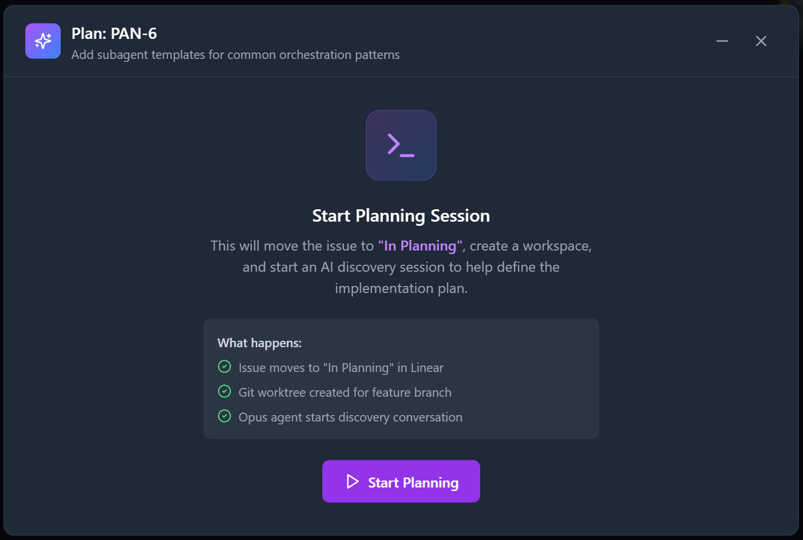
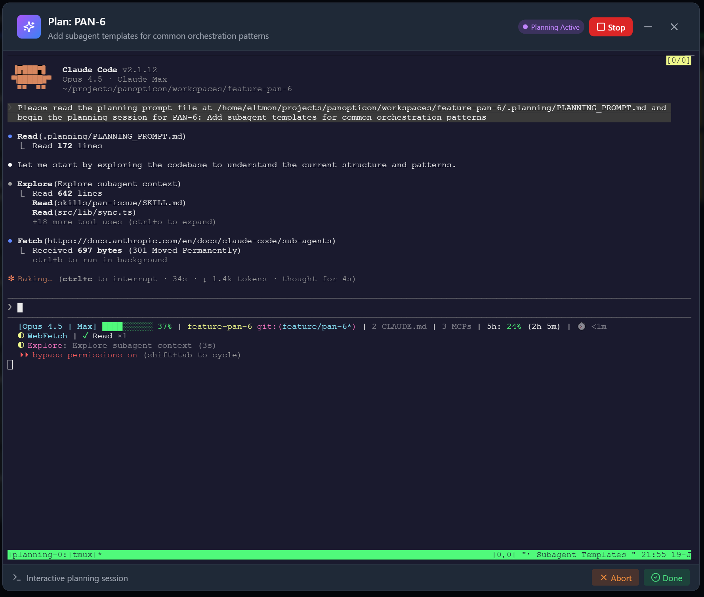
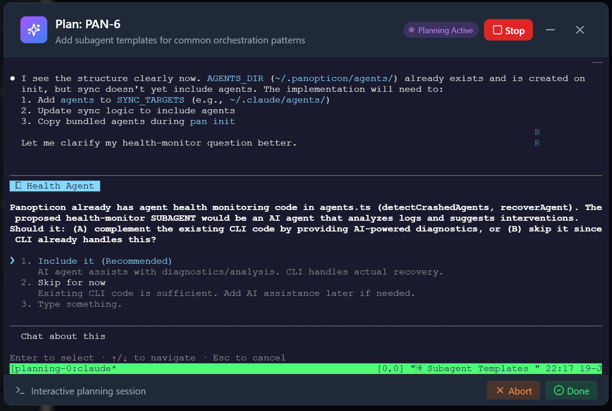
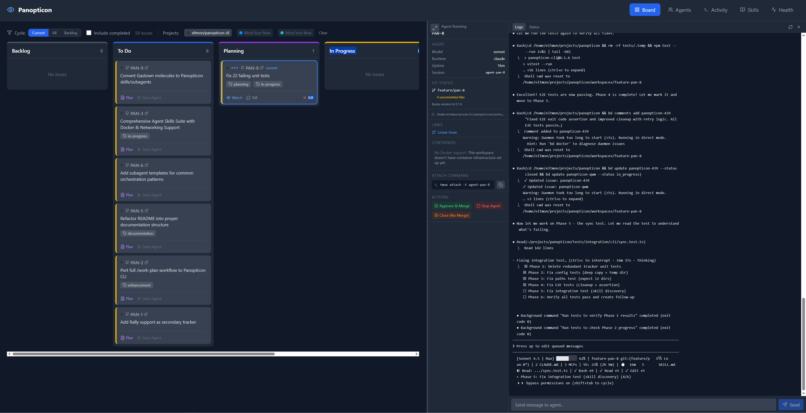

# Panopticon CLI

Multi-agent orchestration for AI coding assistants.

> *"The Panopticon had six sides, one for each of the Founders of Gallifrey..."*

## Overview

Panopticon is a unified orchestration layer for AI coding assistants. It works with:

| Tool | Support |
|------|---------|
| **Claude Code** | Full support |
| **Codex** | Skills sync |
| **Cursor** | Skills sync |
| **Gemini CLI** | Skills sync |
| **Google Antigravity** | Skills sync |

### Features

- **Multi-agent orchestration** - Spawn and manage multiple AI agents in tmux sessions
- **Universal skills** - One SKILL.md format works across all supported tools
- **GUPP Hooks** - Self-propelling agents that auto-resume work
- **Health Monitoring** - Deacon-style stuck detection with auto-recovery
- **Context Engineering** - Structured state management (STATE.md, WORKSPACE.md)
- **Agent CVs** - Work history tracking for capability-based routing

## Quick Start

```bash
# Install Panopticon
npm install -g panopticon-cli

# Install prerequisites and setup (includes optional HTTPS/Traefik)
pan install

# Sync skills to all AI tools
pan sync

# Check system health
pan doctor
```

### HTTPS Setup (Optional)

Panopticon supports local HTTPS via Traefik reverse proxy:

```bash
# Full install (includes Traefik + mkcert for HTTPS)
pan install

# Add to /etc/hosts (macOS/Linux)
echo "127.0.0.1 pan.localhost" | sudo tee -a /etc/hosts

# Start with HTTPS
pan up
# → Dashboard: https://pan.localhost
# → Traefik UI: https://traefik.pan.localhost:8080
```

**Minimal install** (skip Traefik, use ports):
```bash
pan install --minimal
pan up
# → Dashboard: http://localhost:3010
```

See [docs/DNS_SETUP.md](docs/DNS_SETUP.md) for detailed DNS configuration (especially for WSL2).

## Supported Platforms

| Platform | Support |
|----------|---------|
| **Linux** | Full support |
| **macOS** | Full support |
| **Windows** | WSL2 required |

> **Windows users:** Panopticon requires WSL2 (Windows Subsystem for Linux 2). Native Windows is not supported. [Install WSL2](https://docs.microsoft.com/en-us/windows/wsl/install)

## Requirements

### Required
- Node.js 18+
- Git (for worktree-based workspaces)
- Docker (for Traefik and workspace containers)
- tmux (for agent sessions)
- **ttyd** - Web terminal for interactive planning sessions. Auto-installed by `pan install`.
- **GitHub CLI (`gh`)** - For GitHub integration (issues, PRs, merges). [Install](https://cli.github.com/)
- **GitLab CLI (`glab`)** - For GitLab integration (if using GitLab). [Install](https://gitlab.com/gitlab-org/cli)

### Optional
- **mkcert** - For HTTPS certificates (recommended)
- **Linear API key** - For issue tracking integration
- **Beads CLI (bd)** - For persistent task tracking across sessions

### Why CLI tools instead of API tokens?

Panopticon uses `gh` and `glab` CLIs instead of raw API tokens because:
- **Better auth**: OAuth tokens that auto-refresh (no expiring PATs)
- **Simpler setup**: `gh auth login` handles everything
- **Agent-friendly**: Agents can use them for PRs, merges, reviews

## Configuration

Create `~/.panopticon.env`:

```bash
LINEAR_API_KEY=lin_api_xxxxx
GITHUB_TOKEN=ghp_xxxxx  # Optional: for GitHub-tracked projects
```

### Register Projects

Register your local project directories so Panopticon knows where to create workspaces:

```bash
# Register a project
pan project add /path/to/your/project --name myproject

# List registered projects
pan project list
```

### Map Linear Projects to Local Directories

If you have multiple Linear projects, configure which local directory each maps to. Create/edit `~/.panopticon/project-mappings.json`:

```json
[
  {
    "linearProjectId": "abc123",
    "linearProjectName": "Mind Your Now",
    "linearPrefix": "MIN",
    "localPath": "/home/user/projects/myn"
  },
  {
    "linearProjectId": "def456",
    "linearProjectName": "Househunt",
    "linearPrefix": "HH",
    "localPath": "/home/user/projects/househunt"
  }
]
```

The dashboard uses this mapping to determine where to create workspaces when you click "Create Workspace" or "Start Agent" for an issue.

## Commands

### Core Commands

```bash
pan init              # Initialize ~/.panopticon/
pan sync              # Sync skills to all AI tools
pan doctor            # Check system health
pan skills            # List available skills
pan status            # Show running agents
```

### Agent Management

```bash
# Spawn an agent for a Linear issue
pan work issue MIN-123

# List all running agents
pan work status

# Send a message to an agent
pan work tell min-123 "Please also add tests"

# Kill an agent
pan work kill min-123
```

### Health Monitoring

```bash
# Run a health check
pan work health check

# Show health status of all agents
pan work health status

# Start the health daemon (background monitoring)
pan work health daemon --interval 30
```

### GUPP Hooks

```bash
# Check for pending work on hook
pan work hook check

# Push work to an agent's hook
pan work hook push agent-min-123 "Continue with tests"

# Send mail to an agent
pan work hook mail agent-min-123 "Review feedback received"
```

### Workspace Management

**Workspaces are git worktrees** - isolated working directories for each issue/feature. Each workspace:
- Has its own feature branch (e.g., `feature/min-123-add-login`)
- Shares git history with the main repo (no separate clone)
- Can run independently (separate node_modules, builds, etc.)
- Is located at `{project}/workspaces/{issue-id}/`

This allows multiple agents to work on different features simultaneously without conflicts.

#### Git-Backed Collaborative Planning

| Start Planning | Codebase Exploration | Discovery Questions |
|----------------|---------------------|---------------------|
|  |  |  |

Planning artifacts are stored **inside the workspace**, making them part of the feature branch:

```
workspaces/feature-min-123/
├── .planning/
│   ├── output.jsonl          # Full conversation history (tool uses + results)
│   ├── PLANNING_PROMPT.md    # Initial planning prompt
│   ├── CONTINUATION_PROMPT.md # Context for continued sessions
│   └── output-*.jsonl        # Backup of previous rounds
└── ... (code)
```

**This enables:**

1. **Collaborative async planning** - Push your branch, someone else pulls and continues the planning session with full context
2. **Context recovery** - If Claude's context compacts, the full conversation is preserved in the branch
3. **Audit trail** - See how planning decisions were made, what files were explored, what questions were asked
4. **Branch portability** - The planning state travels with the feature branch

**Dashboard workflow (recommended):**

The planning dialog has **Pull** and **Push** buttons that handle git operations automatically:

| Button | What it does |
|--------|--------------|
| **Pull** | Fetches from origin, creates workspace from remote branch if needed, pulls latest changes |
| **Push** | Commits `.planning/` artifacts and pushes to origin |

1. Person A starts planning in dashboard, clicks **Push** when interrupted
2. Person B opens same issue in dashboard, clicks **Pull** → gets Person A's full context
3. Person B continues the planning session and clicks **Push** when done

**CLI workflow:**
```bash
# Person A starts planning
pan work plan MIN-123
# ... answers discovery questions, gets interrupted ...

# Push the branch (includes planning context)
cd workspaces/feature-min-123
git add .planning && git commit -m "WIP: planning session"
git push origin feature/min-123

# Person B continues
git pull origin feature/min-123
pan work plan MIN-123 --continue
# Claude has full context from Person A's session
```

```bash
# Create a workspace (git worktree) without starting an agent
pan workspace create MIN-123

# List all workspaces
pan workspace list

# Destroy a workspace
pan workspace destroy MIN-123

# Force destroy (even with uncommitted changes)
pan workspace destroy MIN-123 --force
```

### Project Management

```bash
# Register a project
pan project add /path/to/project --name myproject

# List managed projects
pan project list

# Remove a project
pan project remove myproject
```

### Context Management

```bash
# Show agent state
pan work context state agent-min-123

# Set a checkpoint
pan work context checkpoint "Completed auth module"

# Search history
pan work context history "test"
```

### Agent CVs

```bash
# View an agent's CV (work history)
pan work cv agent-min-123

# Show agent rankings by success rate
pan work cv --rankings
```

### Crash Recovery

```bash
# Recover a specific crashed agent
pan work recover min-123

# Auto-recover all crashed agents
pan work recover --all
```

## Dashboard



Start the monitoring dashboard:

```bash
pan up
```

**Recommended (containerized with HTTPS):**
- Dashboard: https://pan.localhost
- Traefik UI: https://traefik.pan.localhost:8082

This runs everything in Docker containers, avoiding port conflicts with your other projects.

**Minimal install (no Docker):**
```bash
pan up --minimal
```
- Dashboard: http://localhost:3001

Stop with `pan down`.

## Skills

Panopticon ships with 10+ high-value skills:

| Skill | Description |
|-------|-------------|
| `feature-work` | Standard feature development workflow |
| `bug-fix` | Systematic bug investigation and fix |
| `code-review` | Comprehensive code review checklist |
| `code-review-security` | OWASP Top 10 security analysis |
| `code-review-performance` | Algorithm and resource optimization |
| `refactor` | Safe refactoring with test coverage |
| `release` | Step-by-step release process |
| `incident-response` | Production incident handling |
| `dependency-update` | Safe dependency updates |
| `onboard-codebase` | Understanding new codebases |

### Reserved Skill Names

Panopticon reserves the following skill names. **Do not use these names for project-specific skills** to avoid conflicts:

**Pan operations:**
`pan-down`, `pan-help`, `pan-install`, `pan-issue`, `pan-plan`, `pan-quickstart`, `pan-setup`, `pan-status`, `pan-up`

**Workflow skills:**
`beads`, `bug-fix`, `code-review`, `code-review-performance`, `code-review-security`, `dependency-update`, `feature-work`, `incident-response`, `onboard-codebase`, `refactor`, `release`, `session-health`, `skill-creator`, `web-design-guidelines`, `work-complete`

**Recommendation:** Use a project-specific prefix for your skills (e.g., `myn-standards`, `acme-deployment`) to avoid namespace collisions.

### Project-Specific Skills

Projects can have their own skills alongside Panopticon's:

```
~/.claude/skills/
├── pan-help/           # Symlink → ~/.panopticon/skills/pan-help/
├── feature-work/       # Symlink → ~/.panopticon/skills/feature-work/
└── ... (other pan skills)

{project}/.claude/skills/
├── myn-standards/      # Project-specific (git-tracked)
└── myn-api-patterns/   # Project-specific (git-tracked)
```

Project-specific skills in `{project}/.claude/skills/` are **not managed by Panopticon**. They live in your project's git repo and take precedence over global skills with the same name.

### Skill Distribution

Skills are synced to all supported AI tools via symlinks:

```bash
~/.panopticon/skills/    # Canonical source
    ↓ pan sync
~/.claude/skills/        # Claude Code + Cursor
~/.codex/skills/         # Codex
~/.gemini/skills/        # Gemini CLI
```

## PRD Convention

Panopticon enforces a standard approach to Product Requirements Documents (PRDs) across all managed projects.

### PRD Structure

Every project has a **canonical PRD** that defines the core product:

```
{project}/
├── docs/
│   └── PRD.md              # The canonical PRD (core product definition)
├── workspaces/
│   └── feature-{issue}/
│       └── docs/
│           └── {ISSUE}-plan.md   # Feature PRD (lives in feature branch)
```

| PRD Type | Location | Purpose |
|----------|----------|---------|
| **Canonical PRD** | `docs/PRD.md` | Core product definition, always on main |
| **Feature PRD** | `workspaces/feature-{issue}/docs/{ISSUE}-plan.md` | Feature spec, lives in feature branch, merged with PR |

### Feature PRDs Live in Workspaces

When you start planning an issue, Panopticon creates:
1. A git worktree (workspace) for the feature branch
2. A planning session that generates a feature PRD

The feature PRD **lives in the workspace** (feature branch) because:
- It gets merged with the PR (documentation travels with code)
- If you abort planning and delete the workspace, you don't want orphaned PRDs
- Clean separation - each feature is self-contained

### Project Initialization

When registering a new project with Panopticon (`pan project add`), the system will:

1. **Check for existing PRD** - Look for `docs/PRD.md`, `PRD.md`, `README.md`, or similar
2. **If found**: Use it to create/update the canonical PRD format, prompting for any missing crucial information
3. **If not found**: Generate one by:
   - Analyzing the codebase structure
   - Identifying key technologies and patterns
   - Asking discovery questions about the product

This ensures every Panopticon-managed project has a well-defined canonical PRD that agents can reference.

### PRD Naming Convention

| Document | Naming | Example |
|----------|--------|---------|
| Canonical PRD | `PRD.md` | `docs/PRD.md` |
| Feature PRD | `{ISSUE}-plan.md` | `MIN-123-plan.md`, `PAN-4-plan.md` |
| Planning artifacts | In `.planning/{issue}/` | `.planning/min-123/STATE.md` |

## Architecture

```
~/.panopticon/
  skills/             # Shared skills (SKILL.md format)
  commands/           # Slash commands
  agents/             # Per-agent state
    agent-min-123/
      state.json      # Agent state
      health.json     # Health status
      hook.json       # GUPP work queue
      cv.json         # Work history
      mail/           # Incoming messages
  projects.json       # Managed projects
  backups/            # Sync backups
```

## Health Monitoring (Deacon Pattern)

Panopticon implements the Deacon pattern for stuck agent detection:

- **Ping timeout**: 30 seconds
- **Consecutive failures**: 3 before recovery
- **Cooldown**: 5 minutes between force-kills

When an agent is stuck (no activity for 30+ minutes), Panopticon will:
1. Force kill the tmux session
2. Record the kill in health.json
3. Respawn with crash recovery context

## GUPP (Give Up Push Pop)

> "If there is work on your Hook, YOU MUST RUN IT."

GUPP ensures agents are self-propelling:
1. Work items are pushed to the agent's hook
2. On spawn/recovery, the hook is checked
3. Pending work is injected into the agent's prompt
4. Completed work is popped from the hook

## Development

### Dev vs Production Strategy

Panopticon uses a **shared config, switchable CLI** approach:

```
~/.panopticon/           # Shared by both dev and prod
├── config.toml          # Settings
├── projects.json        # Registered projects
├── project-mappings.json # Linear → local path mappings
├── agents/              # Agent state
└── skills/              # Shared skills
```

Both dev and production versions read/write the same config, so you can switch between them freely.

### Running in Development Mode

```bash
# Clone and setup
git clone https://github.com/eltmon/panopticon.git
cd panopticon
npm install

# Link dev version globally (makes 'pan' use your local code)
npm link

# Start the dashboard (with hot reload)
cd src/dashboard
npm run install:all
npm run dev
# → Frontend: http://localhost:3010
# → API: http://localhost:3011
```

### Switching Between Dev and Prod

```bash
# Use dev version (from your local repo)
cd /path/to/panopticon && npm link

# Switch back to stable release
npm unlink panopticon-cli
npm install -g panopticon-cli
```

### Dashboard Modes

| Mode | Command | Use Case |
|------|---------|----------|
| **Production** | `pan up` | Daily usage, containerized, HTTPS at https://pan.localhost |
| **Dev** | `cd src/dashboard && npm run dev` | Only for active development on Panopticon itself |

**Note:** Use `pan up` for normal usage - it runs in Docker and won't conflict with your project's ports. Only use dev mode when actively working on Panopticon's codebase.

### Working on Panopticon While Using It

If you're both developing Panopticon AND using it for your own projects:

1. **Use `npm link`** so CLI changes take effect immediately
2. **Run dashboard from source** for hot reload on UI changes
3. **Config is shared** - workspaces/agents work the same either way
4. **Test in a real project** - your own usage is the best test

## Troubleshooting

### Slow Vite/React Frontend with Multiple Workspaces

If running multiple containerized workspaces with Vite/React frontends, you may notice CPU spikes and slow HMR. This is because Vite's default file watching polls every 100ms, which compounds with multiple instances.

**Fix:** Increase the polling interval in your `vite.config.mjs`:

```javascript
server: {
    watch: {
        usePolling: true,
        interval: 3000,  // Poll every 3s instead of 100ms default
    },
}
```

A 3000ms interval supports 4-5 concurrent workspaces comfortably while maintaining acceptable HMR responsiveness.

### Corrupted Workspaces

A workspace can become "corrupted" when it exists as a directory but is no longer a valid git worktree. The dashboard will show a yellow "Workspace Corrupted" warning with an option to clean and recreate.

**Symptoms:**
- Dashboard shows "Workspace Corrupted" warning
- `git status` in the workspace fails with "not a git repository"
- The `.git` file is missing from the workspace directory

**Common Causes:**

| Cause | Description |
|-------|-------------|
| **Interrupted creation** | `pan workspace create` was killed mid-execution (Ctrl+C, system crash) |
| **Manual .git deletion** | Someone accidentally deleted the `.git` file in the workspace |
| **Disk space issues** | Ran out of disk space during workspace creation |
| **Git worktree pruning** | Running `git worktree prune` in the main repo removed the worktree link |
| **Force-deleted main repo** | The main repository was moved or deleted while workspaces existed |

**Resolution:**

1. **Via Dashboard (recommended):**
   - Click on the issue to open the detail panel
   - Click "Clean & Recreate" button
   - Review the files that will be deleted
   - Check "Create backup" to preserve your work (recommended)
   - Click "Backup & Recreate"

2. **Via CLI:**
   ```bash
   # Option 1: Manual cleanup
   rm -rf /path/to/project/workspaces/feature-issue-123
   pan workspace create ISSUE-123

   # Option 2: Backup first
   cp -r /path/to/project/workspaces/feature-issue-123 /tmp/backup-issue-123
   rm -rf /path/to/project/workspaces/feature-issue-123
   pan workspace create ISSUE-123
   # Then manually restore files from backup
   ```

**Prevention:**
- Don't interrupt `pan workspace create` commands
- Don't run `git worktree prune` in the main repo without checking for active workspaces
- Ensure adequate disk space before creating workspaces

## ⭐ Star History

<a href="https://star-history.com/#eltmon/panopticon&Date">
 <picture>
   <source media="(prefers-color-scheme: dark)" srcset="https://api.star-history.com/svg?repos=eltmon/panopticon&type=Date&theme=dark" />
   <source media="(prefers-color-scheme: light)" srcset="https://api.star-history.com/svg?repos=eltmon/panopticon&type=Date" />
   
 </picture>
</a>

## ⚖️ License

This project is licensed under the **MIT License** - see the [LICENSE](LICENSE) file for details.

[](https://opensource.org/licenses/MIT)
